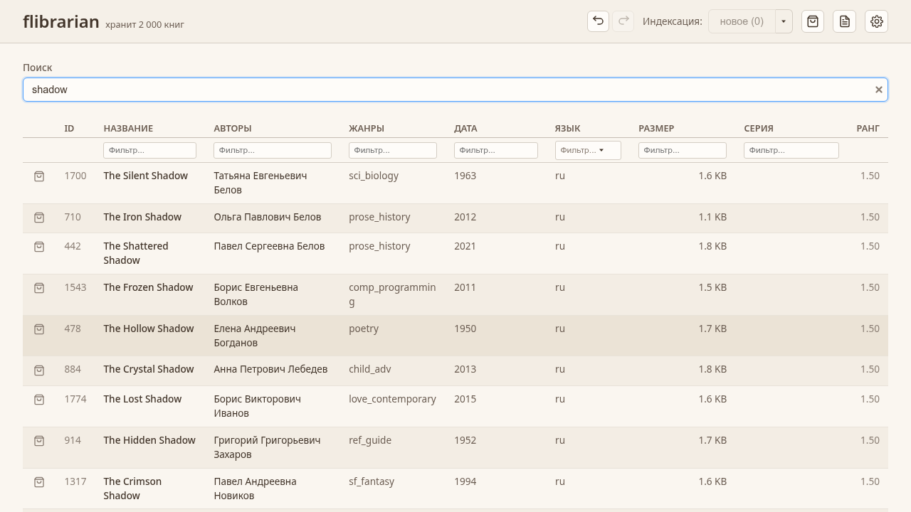

<p align="center">
  
</p>

# flibrarian

Индексация, полнотекстовый поиск и извлечение книг из FB2 ZIP-архивов.

**[Сайт](https://mlavrinenko.github.io/flibrarian/)** · **[Релизы](https://github.com/mlavrinenko/flibrarian/releases)**



## Три варианта

| | Описание | Бинарник |
|---|---|---|
| **GUI** | Десктопное приложение (Tauri + Svelte) | `.deb` / `.rpm` |
| **Web** | Сервер для браузера (Axum) | `flibrarian-web` |
| **CLI** | Командная строка | `flibrarian` |

Все три используют общее ядро на Rust с DuckDB и полнотекстовым поиском.

## Установка

Скачайте нужный бинарник из [GitHub Releases](https://github.com/mlavrinenko/flibrarian/releases).

### Nix

```bash
# Запустить без установки (CLI)
nix run github:mlavrinenko/flibrarian

# Веб-сервер
nix run github:mlavrinenko/flibrarian#web
```

#### Бинарный кеш

CI пушит сборки в `https://mlavrinenko.cachix.org`. Флейк объявляет его в
`nixConfig`, но Nix игнорирует эту настройку для недоверенных флейков — на
NixOS пропишите кеш в конфигурации:

```nix
nix.settings = {
  substituters = [ "https://mlavrinenko.cachix.org" ];
  trusted-public-keys = [
    "mlavrinenko.cachix.org-1:vNcY3Nf5Y1J0D30uNAwrw44CBHbHDd1tGiA18ANz4XY="
  ];
};
```

## Быстрый старт

### GUI / Web

1. Откройте настройки и укажите путь к папке с FB2 ZIP-архивами.
2. Запустите индексацию.
3. Ищите книги, добавляйте в корзину, скачивайте.

### CLI

```bash
# Индексация библиотеки
flibrarian index ./mylib

# Поиск
flibrarian search ./mylib "Толстой"

# Извлечение книги по ID
flibrarian extract ./mylib 42
```

## Разработка

См. [CONTRIBUTING.md](CONTRIBUTING.md).

## Лицензия

MIT
